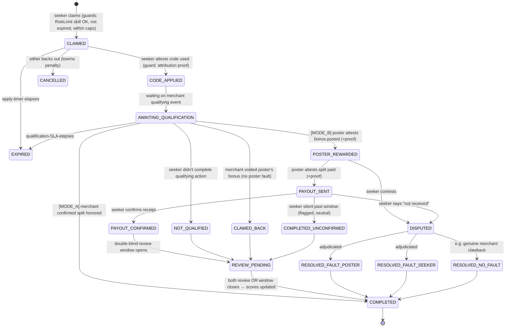

# Vouch — Reputation-Enforced Referral Exchange: State Machine & Skill Orchestrator

> **Status:** Implemented — Phases 1–4 shipped in `claim-service` · **Owner:** Product · **Audience:** engineering
> **Last updated:** 2026-07-12
>
> This document specifies the architecture for Vouch's **no-escrow, reputation-enforced**
> referral-split marketplace. It replaces the escrowed `payment-service` custody flow with a
> deterministic **state machine** whose fuzzy decisions are delegated to a quarantined layer of
> **AI skills**. It is meant to be built from directly.

---

## 0. TL;DR for the engineer

1. Model each deal as an **explicit, persisted state machine** (Spring Statemachine or a hand-rolled
   enum + transition table on `transactions`). Reject any transition not in the table.
2. Append **every transition to an immutable event log** (`transaction_events`). Idempotent, replayable.
3. **The platform never holds funds.** Payout happens either on the merchant's own ledger (Mode A) or
   directly peer-to-peer off-platform (Mode B). `payment-service` becomes a *record*, not custody.
4. Every waiting state has an **owner**, an **SLA timer**, and a **defined timeout transition**. Silence is a modeled event.
5. The value-transfer step is a **two-phase commit** (poster asserts → seeker confirms). Never auto-complete on silence.
6. All fuzzy judgments go through **AI skills** that return `{decision, confidence}`. Low confidence → **human** (`admin`/`support`). Never let a low-confidence skill silently move state.
7. **Reputation is the only enforcement lever**, so it must be earned expensively, lost cheaply, double-blind, weighted, decayed, and **explainable**.

---

## 0.5 Implementation status (as built)

Phases 1–4 are implemented in **`claim-service`** and unit-tested. These naming/scope notes supersede the generic vocabulary used elsewhere in this doc:

- The deal entity is **`Transaction`** / table **`transactions`** (not `claims`); the event log is **`transaction_events`** (not `claim_events`). The legacy `Claim` entity and `/api/v1/claims` controller were **removed**; `admin`/`listing`/`support` read the legacy shape through a `claims` **compatibility view**.
- The full post-rename schema is provisioned at DB-init in **`migrations.sql/V1__complete_schema.sql`**; `claim-service` also carries an idempotent Flyway **`V12`** (`baseline-on-migrate`, baseline 11).
- Intake state names were kept from the existing model: `STARTED → WAITING_FOR_SEEKER_PROOF → PROOF_SUBMITTED_IN_REVIEW → WAITING_FOR_POSTER_PAYMENT` (= *AWAITING_QUALIFICATION*) `→ POSTER_REWARDED → PAYOUT_SENT → PAYOUT_CONFIRMED → TRANSACTION_CLOSED` (plus `NOT_QUALIFIED`, `CLAWED_BACK`, `COMPLETED_UNCONFIRMED`, `DISPUTED`, `CANCELLED`).
- Skills wired behind the `ConfidenceGate`: **ProofVerification** (@submit-proof), **FraudCollusion** (@create, flags high-risk), **DisputeAdjudication** (`adjudicateDispute` + `POST /api/v1/transactions/{id}/adjudicate`, support/admin). **TrustScoring** service + progressive caps (NEW $20 / BRONZE $100 / SILVER $400 / GOLD ∞) enforced at creation and recomputed on close/dispute.
- **Not yet done:** admin/support/listing still read the legacy shape (they boot via the view; runtime claim semantics unchanged); trust scoring is deals+disputes based (review-outcome weighting is a later refinement).

### Verifying a clean-DB boot

```bash
# From the repo root, on a fresh volume:
docker compose down -v && docker compose up -d postgres
# Postgres runs migrations.sql/V1__complete_schema.sql at init (transactions model + claims view).
docker compose up -d claim-service
# On boot: claim-service runs Flyway (baseline 11 → idempotent V12), then Hibernate ddl-auto=validate.
docker compose logs -f claim-service    # expect Flyway OK, NO "Schema-validation" errors, "Started ClaimServiceApplication"
curl -fsS localhost:8083/actuator/health   # -> {"status":"UP"}
```

If an *old* (pre-consolidation) dev DB fails `validate`, recreate the volume (`down -v`); only set `FLYWAY_ENABLED=false` against a DB already consolidated to the transactions model.

---

## 1. Context & the decision being made

The scaffolded codebase is built around **escrow**: `payment-service` + Stripe + a `ledger`
(`escrow_hold`/`escrow_release`/`payout`), with `claim-service` running an ad-hoc "10-step transaction
flow" gated by OCR proof. This design **deliberately removes escrow.**

**Why remove escrow (the upside):** it almost certainly removes money-transmitter licensing exposure,
KYC/AML custody duties, PCI scope, chargeback liability, and 1099 reporting — **provided the platform
never touches funds.**

**What we give up (and must engineer around):** there is no hard guarantee the seeker gets paid.
Reputation is *soft* enforcement, structurally weakest at the exact moment that matters most — the
referee trusting a stranger to voluntarily pay *after* the bonus has already landed. Competitive
research confirms the only place a referral split is *enforced* today is inside individual merchants
(Binance/Bybit, on their own ledger), precisely because atomic settlement is hard for a third party.

**The resolution is segmentation, not escrow** (see §2).

### Market context that shaped this design
- **No competitor** does third-party, merchant-agnostic, reputation-enforced splitting. Directories
  (ReferralCodes.com, Invitation.codes, etc.) broker nothing; Fluz enforces via a closed-loop wallet
  (escrow); crypto exchanges enforce natively but only in-house.
- **ToS risk:** the highest-value verticals (crypto, fintech, banks) explicitly **prohibit public
  posting of codes to strangers** and reserve **clawback + account termination** rights. Robinhood paid
  **$9M** settling a TCPA suit over referral *texts*. → The platform must be **pull, not push**
  (seeker initiates; posters never blast codes), which both dodges spam liability and makes referrals
  look like legitimate personal recommendation.

---

## 2. Settlement modes (the core segmentation)

Every `listing` carries a `settlement_mode`. The state machine branches on it.

| | **Mode A — `MERCHANT_NATIVE`** | **Mode B — `OFF_PLATFORM_ATTESTED`** |
|---|---|---|
| Example | Binance/Bybit commission-split (referrer's slider gives referee 0–20% of commission) | Bank / Robinhood / lump-sum sign-up bonus |
| Who enforces payout | **The merchant, atomically, on its own ledger** | **Nobody** — poster pays seeker directly, off-platform |
| Escrow needed | No (nothing to escrow) | No (by product decision) |
| Vouch's role | Discovery + matching + reputation | Discovery + matching + reputation + payout *attestation* |
| Risk level | **Low** — settlement is guaranteed by merchant | **High** — exit-scam / first-deal defection |
| Reputation signal | "Was the advertised split % honored on-chain?" | "Did the poster actually pay, on time, in full?" |
| Launch priority | **Beachhead — launch here first** | Phase 2, after the reputation graph is dense |

**Rule:** launch on Mode A, where no-escrow is a *feature* (there is literally nothing to escrow) and the
merchant's native kickback is a *sanctioned* mechanism (unlike posting codes on Reddit). Extend to
Mode B only once progressive-trust caps have real history behind them.

---

## 3. Domain model

A **deal** = one `seeker` × one `listing`, tracked by a `claim`. The claim holds the state machine's
current state. Actors: `poster` (code owner), `seeker` (code user), `system`, `support`/`admin`.

### 3.1 Data-model changes (PostgreSQL)

```sql
-- listings: add settlement mode + advertised split
ALTER TABLE listings ADD COLUMN settlement_mode TEXT NOT NULL DEFAULT 'OFF_PLATFORM_ATTESTED';
                                  -- CHECK (settlement_mode IN ('MERCHANT_NATIVE','OFF_PLATFORM_ATTESTED'))
ALTER TABLE listings ADD COLUMN split_terms JSONB;   -- e.g. {"type":"percent","value":20} or {"type":"fixed_cents","value":5000}

-- claims: replace ad-hoc status with the formal state
ALTER TABLE claims ADD COLUMN deal_state TEXT NOT NULL DEFAULT 'CLAIMED';
ALTER TABLE claims ADD COLUMN state_owner TEXT;      -- who owes the next action: 'POSTER' | 'SEEKER' | 'SYSTEM'
ALTER TABLE claims ADD COLUMN sla_deadline TIMESTAMPTZ;

-- immutable event log (append-only) — the source of truth for "what and where"
CREATE TABLE claim_events (
  id           UUID PRIMARY KEY DEFAULT uuid_generate_v4(),
  claim_id     UUID NOT NULL REFERENCES claims(id),
  from_state   TEXT,
  to_state     TEXT NOT NULL,
  event        TEXT NOT NULL,            -- the trigger, e.g. 'SEEKER_CONFIRMED_PAYOUT'
  actor        TEXT NOT NULL,            -- 'POSTER' | 'SEEKER' | 'SYSTEM' | 'SUPPORT'
  skill_verdict JSONB,                   -- {skill, decision, confidence} when a skill drove the transition
  payload      JSONB,
  trace_id     TEXT NOT NULL,
  created_at   TIMESTAMPTZ NOT NULL DEFAULT now()
);
CREATE INDEX idx_claim_events_claim ON claim_events(claim_id, created_at);

-- reviews: promote from "(future)" to first-class, load-bearing
ALTER TABLE reviews ADD COLUMN outcome TEXT;          -- PAID_ON_TIME|PAID_LATE|NOT_PAID|MERCHANT_CLAWBACK|SEEKER_NO_QUALIFY|GHOSTED
ALTER TABLE reviews ADD COLUMN reveal_at TIMESTAMPTZ;  -- double-blind reveal timestamp
ALTER TABLE reviews ADD COLUMN weight NUMERIC;         -- computed: value × counterparty-trust × recency

-- trust profile per user (fed by the Trust Scoring skill)
CREATE TABLE trust_profiles (
  user_id            UUID PRIMARY KEY REFERENCES users(id),
  score              NUMERIC NOT NULL DEFAULT 0,       -- 0..1000, explainable
  tier               TEXT NOT NULL DEFAULT 'NEW',      -- NEW|BRONZE|SILVER|GOLD
  verification_level INT NOT NULL DEFAULT 0,           -- bitmask: email|phone|device|id
  max_deal_value_cents BIGINT NOT NULL DEFAULT 2000,   -- progressive cap
  deals_completed    INT NOT NULL DEFAULT 0,
  disputes_lost      INT NOT NULL DEFAULT 0,
  updated_at         TIMESTAMPTZ NOT NULL DEFAULT now()
);

-- settlement record (NOT custody) — repurposed from `ledger`
-- stores ATTESTED payments + proof references; the platform never holds funds.
```

> **Migration note:** map legacy `claims.status`
> (`draft/submitted/under_review/approved/rejected/paid/disputed`) onto the new `deal_state` during
> cutover; keep the old column read-only for one release, then drop.

---

## 4. State machine

### 4.1 Diagram



### 4.2 Transition table

| From | Event | To | Guard (skill / rule) | Owner after | SLA timer | On timeout |
|---|---|---|---|---|---|---|
| `CLAIMED` | seeker applies code | `CODE_APPLIED` | **Attribution**: Mode A → merchant link confirmed; Mode B → Proof-Verification OCR ≥ threshold (else manual) | SYSTEM | 72h | → `EXPIRED` |
| `CLAIMED` | cancel | `CANCELLED` | either party | — | — | — |
| `CODE_APPLIED` | — | `AWAITING_QUALIFICATION` | auto | SYSTEM | merchant-specific (e.g. 30–90d) | → `EXPIRED` |
| `AWAITING_QUALIFICATION` | merchant confirms split honored **(Mode A)** | `COMPLETED` | merchant tracking / poster+seeker concur | SYSTEM | — | — |
| `AWAITING_QUALIFICATION` | poster: bonus posted **(Mode B)** | `POSTER_REWARDED` | optional proof | POSTER | 7d | → nudge, then `DISPUTED` |
| `AWAITING_QUALIFICATION` | seeker didn't qualify | `NOT_QUALIFIED` | — | SYSTEM | — | — |
| `AWAITING_QUALIFICATION` | merchant clawed back | `CLAWED_BACK` | evidence of void | SYSTEM | — | — |
| `POSTER_REWARDED` | poster: split paid | `PAYOUT_SENT` | optional payment proof (OCR) | SEEKER | 5d | → nudge, then `COMPLETED_UNCONFIRMED` |
| `PAYOUT_SENT` | seeker confirms | `PAYOUT_CONFIRMED` | — | SYSTEM | — | — |
| `PAYOUT_SENT` | seeker: not received | `DISPUTED` | — | SUPPORT | — | — |
| `PAYOUT_SENT` | seeker silent | `COMPLETED_UNCONFIRMED` | timeout | SYSTEM | — | flagged for Fraud skill |
| `*` | seeker/poster contests | `DISPUTED` | — | SUPPORT | Adjudication SLA | escalate |
| `DISPUTED` | adjudicated | `RESOLVED_*` | **Dispute-Adjudication** skill; low confidence → human | SYSTEM | — | — |
| `REVIEW_PENDING` | both review / window ends | `COMPLETED` | **Review-Analysis** + **Trust-Scoring** skills | — | 14d | reveal + close |

### 4.3 Robustness invariants (enforce in code, cover with tests)

1. **No ad-hoc mutation** — the only way to change `deal_state` is `transition(claim, event)`; invalid pairs throw.
2. **Every transition writes exactly one `claim_events` row** in the same DB transaction (atomic + auditable).
3. **Every non-terminal state has a timer and a timeout transition.** Drive timers from Redis delayed keys / Quartz (both in-stack). Silence is never a hang.
4. **Two-phase value transfer.** `PAYOUT_SENT` (poster asserts) requires `PAYOUT_CONFIRMED` (seeker confirms). **Never auto-complete a payment claim on seeker silence** — degrade to `COMPLETED_UNCONFIRMED` (neutral score, *flagged* pattern). Posters with many unconfirmed closes and seekers who never confirm are both anomalies for the Fraud skill.
5. **`CLAWED_BACK` / `NOT_QUALIFIED` resolve with no poster fault** when evidence supports a genuine merchant void — do not punish honesty (this *will* happen; the ToS research guarantees it).

---

## 5. AI skill orchestrator

Keep process control **deterministic**; quarantine every fuzzy judgment behind a **confidence gate**.
Each skill is a bounded, single-responsibility service (LLM-backed, ML, or rules — pluggable). The
state machine decides *when* to invoke; the skill returns a verdict; a low-confidence verdict routes
to a human and never silently moves state.

```
   STATE MACHINE ENGINE (deterministic: states · transitions · timers · event log)
            │  invokes at hook points, consumes {decision, confidence}
            ▼
   SKILL LAYER ── RiskLimit · ProofVerification · FraudCollusion ·
                  ReviewAnalysis · TrustScoring · DisputeAdjudication
            │  confidence < threshold
            ▼
   HUMAN FALLBACK (admin-service review · support-service desk)
```

### 5.1 Universal skill contract

```java
public interface Skill<I, O> {
    SkillVerdict<O> evaluate(I input);
}
public record SkillVerdict<O>(
    O decision,            // the structured recommendation
    double confidence,     // 0.0 .. 1.0
    String rationale,      // human-readable, stored on claim_events.skill_verdict
    List<String> evidence  // ids/refs the decision relied on
) {}
```

**Gate rule (in the state machine, not the skill):**
`if (verdict.confidence() >= T_skill) autoApply(); else routeToHuman();`
Thresholds `T_skill` are per-skill config, tuned from human-override rates.

### 5.2 Skill catalogue

| Skill | Hook point | Input | Output (`decision`) | If low confidence |
|---|---|---|---|---|
| **RiskLimit** | `@CLAIMED` | both trust profiles, listing value, mode | `{allow, maxValue, requiredVerification, requireProof}` | reduce cap / require ID |
| **ProofVerification** | `@CODE_APPLIED`, `@PAYOUT_SENT` (Mode B) | uploaded screenshot | `{verified, extracted:{amount,date,merchant}}` (reuse Google Vision OCR) | → manual admin review |
| **FraudCollusion** | continuous + `@CLAIMED` | device/IP/fingerprint graph, deal graph, velocity | `{riskLevel, signals:[self_referral, sybil_ring, review_ring, velocity]}` | flag + throttle, notify support |
| **ReviewAnalysis** | `@REVIEW_PENDING` | both free-text reviews + structured outcome | `{normalizedOutcome, fakeReviewProb, sentiment}` | discount review weight |
| **TrustScoring** | `@COMPLETED`, post-dispute | verified deal history | `{score, tier, maxDealValue, explanation}` | conservative (lower) score |
| **DisputeAdjudication** | `@DISPUTED` | chat (`messages`), evidence+OCR, both attestations, trust histories | `{fault, remedy, confidence}` | → human support desk |

**Highest-leverage skill = DisputeAdjudication.** In a no-escrow world the *only* enforcement is a
reputation adjustment, so an unfair adjudication is as damaging as a stolen payout. Human fallback is
non-negotiable; auto-resolve only on high confidence with strong evidence.

---

## 6. Reputation engine

The system *totally depends* on reviews, so review-gaming is the #1 existential risk. Non-negotiables:

- **No review without a verified completed deal.** Kills fabricated reputation at the source.
- **Double-blind reveal** (Airbnb model): both submit before either sees the other (`reviews.reveal_at`). Kills retaliation.
- **Trust score ≠ average stars.** Compute from *structured verified outcomes* (`reviews.outcome`),
  **weighted by deal value × counterparty trust × recency**, with **time decay**. A 5★ from a fresh Sybil ≈ 0.
- **Progressive trust caps** (defeats exit-scam): `trust_profiles.max_deal_value_cents` starts low; higher
  value unlocks only with a long clean verified history worth *more than any single scam*.
- **Sybil/collusion detection is continuous:** block self-referral via device/IP fingerprint (already in
  stack); flag account pairs that only ever transact with each other.
- **Explainability:** users must see *why* their score is what it is (`TrustScoring.explanation`). An
  opaque score in a reputation-only system breeds distrust and gaming.

**Attribution is a first-order concern** (the failure literature says programs die on "no one trusts the
rewards"). The `CODE_APPLIED` guard must *prove* the referee linked under this poster's code — merchant
tracking in Mode A, OCR proof in Mode B — never take it on faith.

---

## 7. Service mapping (what changes in the repo)

| Service / table | Today | Change |
|---|---|---|
| `payment-service` / Stripe / `ledger` | Escrow custody | **Demote to settlement *record*** (attested payments + proof refs). Platform never holds funds. Stripe only for billing *our own* fees. |
| `claim-service` | Ad-hoc "10-step" flow | **Host the state machine** + emit a domain event per transition. |
| `reviews` table | "(future)" | **First-class + load-bearing** (§3.1). |
| `users` / new `trust_profiles` | role/status only | Add trust profile fed by TrustScoring. |
| `orchestration-service` (BFF) | Feign aggregation | Candidate host for the **skill layer**; or fold skills into `claim-service`. |
| `admin-service` / `support-service` | Manual review/payout | **Dispute-adjudication console** — human fallback for low-confidence verdicts. |
| `analytics-service` / `audit-service` | Events / audit | **Consume the transition event stream** — also the fuel for FraudCollusion. |

---

## 8. Consequences to resolve (product + legal — not yet decided)

1. **Monetization.** The old 10% cut only worked because the platform held the money. No custody → bill
   fees **directly** (subscription / featured listings / lead fees via Stripe as a normal merchant),
   **not** skimmed from the P2P transfer — skimming may drag money-transmitter licensing back in.
2. **Legal review required.** Confirm the no-custody structure actually avoids MTL/KYC in target
   jurisdictions, and that facilitating shared referrals doesn't create liability under merchant ToS.
   *This document is not legal advice.*
3. **Accepted default rate (Mode B).** Decide explicitly what fraction of Mode-B deals may end unpaid,
   and make the dispute/reputation remedy the stated recourse. If that number is unacceptable, Mode B
   needs escrow after all — Mode A does not.
4. **Vertical sequencing.** Launch Mode A (crypto commission splits) first; do **not** launch on bank
   bonuses (harshest ToS + hardest settlement) until the reputation graph is dense.

---

## 9. Open questions

- Do we need a lightweight *optional* escrow tier for high-value Mode-B deals (hybrid), or hold the line on pure no-escrow?
- Which crypto merchants' native-split APIs can we integrate for Mode-A attribution at launch?
- Trust-score algorithm: rules-first (explainable, shippable now) vs ML (needs data we don't have yet)? Recommend rules-first, ML later.
- `claim` vs `transaction` domain naming — resolve the open product decision noted in `.okf/log.md` before building.
```
